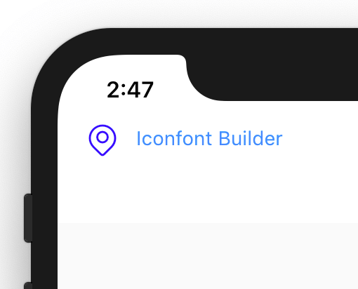

# Convenient generation of icoont icon font for flutter

[查看中文文档](./README_CN.md)

[iconfont.com](https://www.iconfont.cn/) have 500 million icons, and designers of various companies are constantly adding new icons to it. This library is only for the convenience of using iconfont.com Font Icon Library in flutter.

- It can be compiled into various options such as icon data and icon components
- The name in the original icon file can be mapped to dart file and automatically converted to Pinyin
- Font family and component name can be customized
- The generated icondata will not have duplicate names or special characters
- Used in multiple projects

## Preparation

Download the font package from the [iconfont.com](https://www.iconfont.cn/) website selection, extract and copy `demo_index.html` and `iconcont.ttf` to the project.

```
- your-project
    - ios
    - android
    - lib
    - fonts
      # Parse according to this HTML file, so you need to keep it before compiling
      demo_index.html
      iconfont.ttf
```

Edit pubspec.yaml, import fonts file:

```yaml
fonts:
  - family: Iconfont
    fonts:
      - asset: fonts/iconfont.ttf
```

## Install iconfont_builder to dart global

Make sure your computer has a dart environment. If not, install dart:

```sh
$ brew install dart
```

Install iconfont_builder to dart global as a command-line tool:

```sh
$ pub global activate iconfont_builder
```

## Use Iconfont in Flutter

Use iconfont_builder build Iconfont.dart file:

```sh
$ iconfont_builder --from ./fonts --to ./lib/iconfont.dart
```

You can browse the generated `lib/iconcont.dart`, which is actually the mapping of icon names:

```dart
class Iconfont {
    // iconName: all
  static const all = IconData(
    0xe697,
    fontFamily: 'Iconfont',
    matchTextDirection: true,
  );

  // iconName: back
  static const back = IconData(
    0xe698,
    fontFamily: 'Iconfont',
    matchTextDirection: true,
  );
  ...
```

One of the advantages of using icon name as an attribute is that dart will have a good prompt, and const attribute will be processed at AOT compilation time, with better performance

Some icons are named casually, even in Chinese. `iconfont_builder` has formatted the names that do not conform to dart naming specification, and kept the original names as comments.

```dart
import './iconfont.dart';

void main() {
  // Icon names in iconfont are mapped to iconfont objects
  // Iconfont.local is a IconData
  final theIcon = Icon(Iconfont.local);
  // ...
}
```



### Custom iconcont class name

The default class name is iconcont. When compiling, add the command '-- class class name', which can replace the 'iconcont' class name

```sh
$ iconfont_builder --from ./fonts --to ./lib/Iconfont.dart --class Icn
```

Then reference with the new class name:

```dart
import './Iconfont.dart';

void main() {
  final theIcon = Icon(Icn.name);
}
```

### Custom font name

iconfont_builder uses `iconfont` as `font-family` by default. Sometimes we may use multiple fonts at the same time. At this time, we need to customize the font name.

During compilation, add the command `--family <font-name>` action，replace `Iconfont` font-family:

```sh
$ iconfont_builder --from ./fonts --to ./lib/Iconfont.dart --family OtherIcon
```

Then edit pubspec.yaml and reference the font name just set

```yaml
fonts:
  - family: OtherIcon
    fonts:
      - asset: fonts/iconfont.ttf
```

### Use Icon Widget pattern

The icondata object is compiled by default, which is consistent with the habit of using the default icons of flutter. If you need to use it more briefly, you can directly compile it into an icon widget.

Use iconcont to compile iconcont.dart, and add `-- type Icon` command:

```sh
$ iconfont_builder --type Icon --from ./fonts --to ./lib/Iconfont.dart
```

```dart
import './Iconfont.dart';

void main() {
  // At this time, Iconcont.name is a function that directly returns an icon component
  final theIcon = Iconfont.data();
}
```

## View help

```dart
$ iconfont_builder --help
```
